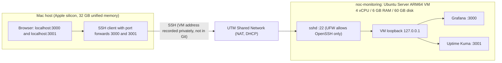
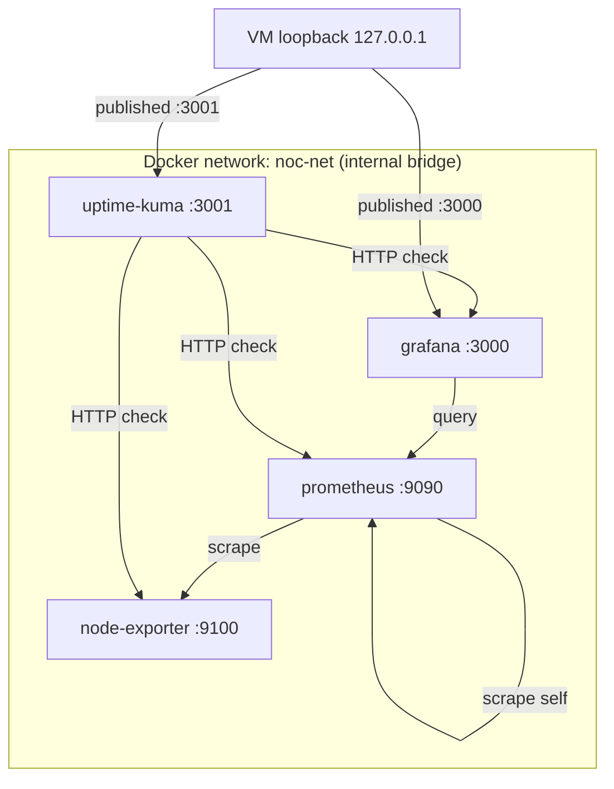

# Network & Architecture Diagram

> Status: **Deployed.** Reflects the running stack on the `noc-monitoring` VM.
> Uses placeholder addresses only; no real host or network details are recorded
> in this repo.

## Mac to VM access path

Grafana and Uptime Kuma are published on the VM's loopback address only. The Mac
reaches them through an SSH tunnel, so no dashboard port is open on the VM's
network interface.

No Bridged adapter exists. The VM is not reachable from the wider home LAN. Docker
published ports bypass UFW, so the safeguard is the `127.0.0.1` bind address in
`docker-compose.yml`, not a firewall rule.

## Docker Compose network (inside the VM)

Prometheus and Node Exporter are **not** published to the VM. They are reachable
only inside `noc-net`: Prometheus by Grafana and Uptime Kuma, Node Exporter by
Prometheus and Uptime Kuma.

## Known limitation

Node Exporter runs on the bridge network, so its network-interface metrics describe
the container, not the VM. CPU, memory and disk metrics are unaffected. Use
`network_mode: host` if network panels are added later.
